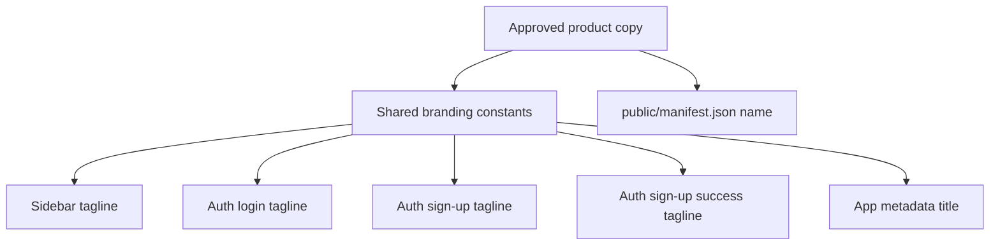

# Tech Spec — Brand copy rename for sidebar, auth, and app metadata

**AIDLC phase:** Design (one **Unit** per Tech Spec; split only if independently implementable)  
**Grounding:** This document implements the approved **Product Spec** and must **link** to existing **ADRs** instead of re-deriving org-wide architecture.

---

## Overview

| Field | Value |
|-------|-------|
| **Unit / scope** | Update the approved tagline to `Imaginary Personal finance, simplified` across the existing shell, auth, browser-title, and installed-app naming surfaces. |
| **Feature** | `feature/imaginary-personal-finance-sidebar-copy/` and GitHub issue [#2](https://github.com/csackrider/fake-folio/issues/2) |
| **Product Spec** | `feature/imaginary-personal-finance-sidebar-copy/product-spec.md` |
| **Status** | In review |
| **Author** | Cursor Cloud Agent |
| **Created** | 2026-05-02 |
| **Last updated** | 2026-05-02 |

## Context

### Summary

This Unit is a copy-only branding change with one engineering goal: replace the currently duplicated tagline text with the approved copy `Imaginary Personal finance, simplified` everywhere it appears in user-facing application chrome and app metadata that are already in scope from the Product Spec. The implementation should stay lightweight, avoid route or data-model changes, and reduce future drift between the shell, auth screens, and browser/PWA naming.

### Existing system & documentation

- **Repo layout / services:** FakeFolio is a Next.js App Router app. The primary non-auth shell renders through `components/app-shell.tsx`, which includes `components/sidebar.tsx`. Auth entry screens live under `app/auth/`. App-level browser metadata is declared in `app/layout.tsx`, and installed-app naming currently lives in `public/manifest.json`.
- **Relevant ADRs:** None present in the repo snapshot for this Unit.
- **Prior art in repo:** Branding copy is currently hardcoded inline in `components/sidebar.tsx`, `app/auth/login/page.tsx`, `app/auth/sign-up/page.tsx`, `app/auth/sign-up-success/page.tsx`, `app/layout.tsx`, and `public/manifest.json`.
- **Process grounding note:** `docs/AIDLC.md` was not present in the current workspace snapshot, so this Tech Spec follows the approved Product Spec, the `/design` skill instructions, `AGENTS.md`, and the shared Tech Spec template.

### Out of scope for this Unit

- Renaming the product name `FakeFolio`
- Changing navigation, sidebar structure, or auth flows
- Changing descriptive marketing copy such as metadata `description`
- Introducing Supabase, auth-policy, storage, or database changes
- Refreshing icons, logos, screenshots, or other brand assets
- Expanding the rename beyond the currently identified in-scope surfaces

## Architecture

### High-level design

The change should be implemented as a single, low-risk branding slice with one source of truth for TypeScript-rendered copy and one explicit static manifest update:

1. Add a small shared branding module (for example `lib/branding.ts`) that exports:
   - `APP_NAME = 'FakeFolio'`
   - `APP_TAGLINE = 'Imaginary Personal finance, simplified'`
   - `APP_TITLE = 'FakeFolio — Imaginary Personal finance, simplified'`
2. Update all TS/TSX rendering surfaces to consume those exports instead of repeating inline literals:
   - `components/sidebar.tsx`
   - `app/auth/login/page.tsx`
   - `app/auth/sign-up/page.tsx`
   - `app/auth/sign-up-success/page.tsx`
   - `app/layout.tsx`
3. Update `public/manifest.json` so its `name` matches `APP_TITLE` exactly while keeping `short_name` as `FakeFolio`.

This keeps the build minimal while still removing most duplication. The manifest remains a static JSON boundary in this Unit; the build phase should update it directly rather than introducing new runtime routing or metadata infrastructure for such a small scope change.



### Integration points

| System | Contract | Notes |
|--------|----------|-------|
| Product Spec | Approved copy must remain exactly `Imaginary Personal finance, simplified`. | No copy variations or title-case substitutions. |
| `components/app-shell.tsx` | Shell continues rendering sidebar only on non-`/auth` routes. | No shell routing logic changes are needed. |
| `components/sidebar.tsx` | Display the approved tagline under the `FakeFolio` heading. | Preserve existing typography and layout unless the longer copy causes clipping. |
| `app/auth/login/page.tsx` | Display the approved tagline under the `FakeFolio` heading. | No auth behavior changes. |
| `app/auth/sign-up/page.tsx` | Display the approved tagline under the `FakeFolio` heading. | No form or redirect changes. |
| `app/auth/sign-up-success/page.tsx` | Display the approved tagline under the `FakeFolio` heading. | No content changes outside the tagline. |
| `app/layout.tsx` | Set metadata title to `FakeFolio — Imaginary Personal finance, simplified`. | Description, icons, and Apple web app title stay unchanged for this Unit. |
| `public/manifest.json` | Set `name` to `FakeFolio — Imaginary Personal finance, simplified`. | `short_name` remains `FakeFolio` unless Product later requests otherwise. |

## Data

There are no schema changes, migrations, storage changes, or persisted-data impacts in this Unit.

Implementation adds at most one new source file for copy constants and updates existing static strings. No user data, analytics payloads, or localStorage keys change.

## APIs & contracts

There are no external API, database, or server-action contract changes.

The only internal contract introduced by this Unit is a shared branding-copy module for TS/TSX surfaces. A representative shape is:

```ts
export const APP_NAME = 'FakeFolio'
export const APP_TAGLINE = 'Imaginary Personal finance, simplified'
export const APP_TITLE = `${APP_NAME} — ${APP_TAGLINE}`
```

Contract requirements:

- `APP_TAGLINE` must match the Product Spec string exactly.
- `APP_TITLE` must be used for browser-title metadata.
- `public/manifest.json` must use the same final title string for `name`, even though JSON cannot import the module.

## UI / client (if applicable)

- **Sidebar:** Preserve the current heading hierarchy and styles (`FakeFolio` heading plus muted tagline beneath it). The only intended visual change is the text content.
- **Auth screens:** Preserve the current login, sign-up, and sign-up-success layouts. Replace only the tagline line above the card content.
- **Browser metadata:** Update the title visible in browser tabs to match the approved brand wording while keeping the rest of the metadata object intact.
- **Installed-app / PWA naming:** Update the manifest `name` so install surfaces align with the same approved title.
- **Responsive behavior:** Because the new tagline is longer, Review must confirm the sidebar header remains readable at current desktop widths and the auth-header line wraps cleanly on narrow viewports if needed.
- **Accessibility:** This is text-only content replacement. No semantic, focus, keyboard, or ARIA changes are expected.

## Security & privacy

- No authentication or authorization behavior changes
- No secrets, tokens, or environment-variable changes
- No user-generated content or stored data changes
- No new network calls or third-party dependencies

Security review outcome for this Unit is effectively "no material security delta," provided the build remains limited to static copy updates.

## Acceptance criteria (for Review)

Testable conditions that **Review** will check against implementation.

- [ ] The approved tagline string is recorded in code exactly as `Imaginary Personal finance, simplified` and is used by the sidebar plus the login, sign-up, and sign-up-success screens.
- [ ] `app/layout.tsx` exposes the browser title `FakeFolio — Imaginary Personal finance, simplified`.
- [ ] `public/manifest.json` exposes the installed-app `name` `FakeFolio — Imaginary Personal finance, simplified` and preserves `short_name: "FakeFolio"`.
- [ ] No user-facing runtime occurrences of `Personal finance, simplified` or `Personal Finance, Simplified` remain in in-scope app files after implementation, excluding historical/spec documentation under `feature/`.
- [ ] The longer approved tagline remains readable in the sidebar header and on auth screens without clipping, overlap, or broken layout.
- [ ] No auth behavior, routes, metadata description text, or navigation behavior changes as part of this Unit.

## Testing approach

| Layer | What we prove | Notes |
|-------|----------------|-------|
| Unit | If the build phase introduces a shared branding module, it exposes the exact approved constants. | Add a tiny test only if the app already has a practical test harness available; do not add a new test framework just for this copy change. |
| Integration | `npm run build` succeeds after updating all in-scope files. | This validates Next.js metadata wiring and route compilation. |
| Static verification | Repo search shows the old tagline no longer appears in runtime app sources or manifest files. | Use targeted search during Build/Review; exclude spec docs to avoid false positives. |
| Manual UI | `/`, `/auth/login`, `/auth/sign-up`, and `/auth/sign-up-success` show the approved copy on their visible headings. | Validate with auth enabled or disabled as applicable to the environment. |
| Manual browser/PWA | Browser tab title and manifest `name` reflect the approved rename. | Verify tab title directly; inspect the served manifest or install surface if feasible. |

Because the repository currently does not expose an app-specific test runner in `package.json`, the preferred proof for this Unit is production build verification plus targeted manual checks instead of adding low-value test infrastructure.

## Rollout & operations

### Rollout plan

- Deploy as a standard app update with no feature flag.
- No backwards-compatibility handling is needed because this change only affects static copy.
- Release notes are optional; stakeholder review of the visible copy is the primary rollout gate.

### Monitoring & observability

- No new operational metrics, logs, or alerts are required.
- Post-deploy confidence comes from manual smoke-checking the in-scope pages and browser/PWA title surfaces.

### Rollback

- Revert the branding constant updates and manifest/title string changes in a single rollback commit if the approved copy changes again or stakeholder review rejects the wording.
- No data cleanup or migration rollback is required.

## Risks & open technical questions

| Risk / question | Mitigation or owner |
|-----------------|---------------------|
| The longer tagline may wrap awkwardly in the fixed-width sidebar header. | Build phase should preserve current styling first, then verify visually at the current desktop shell width before requesting any design follow-up. |
| `public/manifest.json` remains a second copy source even if TS/TSX surfaces share a constant. | Explicitly include manifest alignment in Review acceptance criteria and build checklist. |
| `docs/AIDLC.md` was not available in the current repo snapshot. | Treat this Tech Spec as grounded in the approved Product Spec and shared AIDLC templates; future repo cleanup can restore the missing doc if needed. |

## Design review pass synthesis

### Architecture / boundaries

- Keep this Unit in the presentation/configuration layer only.
- Prefer a small shared branding module over repeated literals in TS/TSX files.
- Avoid introducing new abstractions beyond branding constants because the feature is intentionally narrow.

### Frontend

- Preserve existing component boundaries and page layouts.
- Update text content without changing interaction flows, card structure, or navigation.
- Verify the longer copy still reads naturally in compact UI spaces.

### Backend / API

- No backend, API, Supabase, middleware, or server-action changes are required.
- No new data contract or auth-session behavior should be introduced by this Unit.

### Testing strategy

- Favor `npm run build`, targeted repo search, and manual smoke checks.
- Only add automated tests if a minimal, already-supported harness makes them cheap and stable.

### CI / Docker / deploy

- Existing GitHub Actions do not require workflow edits for this Unit.
- No app Dockerfiles or compose assets are present in the product repo path, so container rollout is not part of scope.
- Existing build validation remains the main CI gate for implementation.

## Change history

| Date | Author | Changes |
|------|--------|---------|
| 2026-05-02 | Cursor Cloud Agent | Initial Tech Spec draft for issue #2 design phase. |
